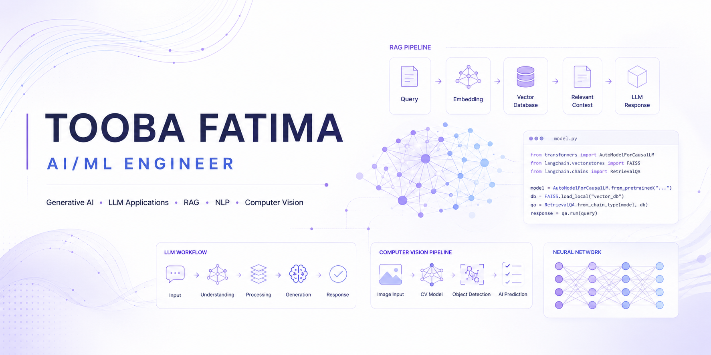

<h1 align="center">Hi, I'm Tooba Fatima 👋</h1>

<h3 align="center">
AI/ML Engineer | Generative AI | LLM Applications | RAG Systems | NLP | Computer Vision
</h3>

Building intelligent AI systems by combining Machine Learning, Generative AI, and modern AI engineering practices.

🌐 <a href="https://toobafatima-portfolio.vercel.app/">Portfolio</a>
&nbsp;&nbsp;•&nbsp;&nbsp;
💼 <a href="https://www.linkedin.com/in/tooba-fatima-b565a5298/">LinkedIn</a>
&nbsp;&nbsp;•&nbsp;&nbsp;
📧 Email: toobafatima21ai@gmail.com

---
 

  
  
  
  

## 👩‍💻 About Me

Artificial Intelligence undergraduate focused on building intelligent AI systems using **Generative AI, Large Language Models (LLMs), Retrieval-Augmented Generation (RAG), Natural Language Processing (NLP), Computer Vision, and Machine Learning**.

Passionate about developing end-to-end AI applications that combine modern AI models, retrieval systems, data pipelines, and user-centric experiences to solve real-world problems.

Currently exploring advanced AI engineering, LLM-powered applications, intelligent document systems, AI workflow optimization, and production-ready AI solutions.
---
## 🚀 Featured AI Systems

<table>
<tr>

<td width="50%" valign="top">

<h3 align="center">📄 AI Contract & Legal Document Risk Analyzer</h3>

AI-powered document intelligence platform for contract analysis, clause extraction, risk identification, and context-aware document interaction.

</td>

<td width="50%" valign="top">

<h3 align="center">🧠 MindMate AI</h3>

AI wellness assistant using conversational AI, emotion understanding, sentiment analysis, and context-aware response generation.

</td>

</tr>

<tr>

<td width="50%" valign="top">

<h3 align="center">🎯 AI Resume Screening & Candidate Ranking</h3>

AI recruitment intelligence system for resume analysis, skill extraction, job matching, and candidate ranking.

</td>

<td width="50%" valign="top">

<h3 align="center">👁️ VisionAI Recognizer</h3>

Computer vision intelligence system combining object detection and OCR for real-world visual understanding.

</td>

</tr>
</table>
---
<h2 align="center"><b>🔬 More Applied AI Work</b></h2>

Additional AI engineering projects exploring NLP, recommendation systems, document intelligence, and retrieval-based architectures.

 <table>
<tr>

<td width="50%">

<h3 align="center">💬 Context-Aware RAG Chatbot</h3>

Local LLM-powered document assistant using Retrieval-Augmented Generation for context-aware question answering.

</td>

<td width="50%">

<h3 align="center">📰 AI News Topic Classifier</h3>

BERT-based NLP system for intelligent news categorization and text understanding.

</td>

</tr>

<tr>

<td width="50%">

<h3 align="center">📝 AI Document Summarizer</h3>

Extractive document summarization system using NLP preprocessing and text analysis.

</td>

<td width="50%">

<h3 align="center">🎯 AI Career Recommendation Engine</h3>

Machine learning based recommendation system for career guidance and personalized suggestions.

</td>

</tr>
</table>

---
# 🛠️ Technical Skills

### 🤖 Generative AI & LLM Engineering

### 🧠 Machine Learning & Deep Learning

### 📝 NLP & Language Intelligence

### 👁️ Computer Vision

### 🚀 Development & Deployment

---

⭐ Engineering intelligent AI solutions that bridge cutting-edge research and real-world impact.

